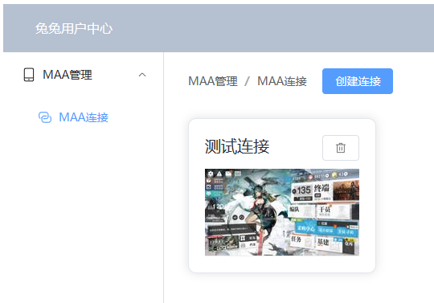
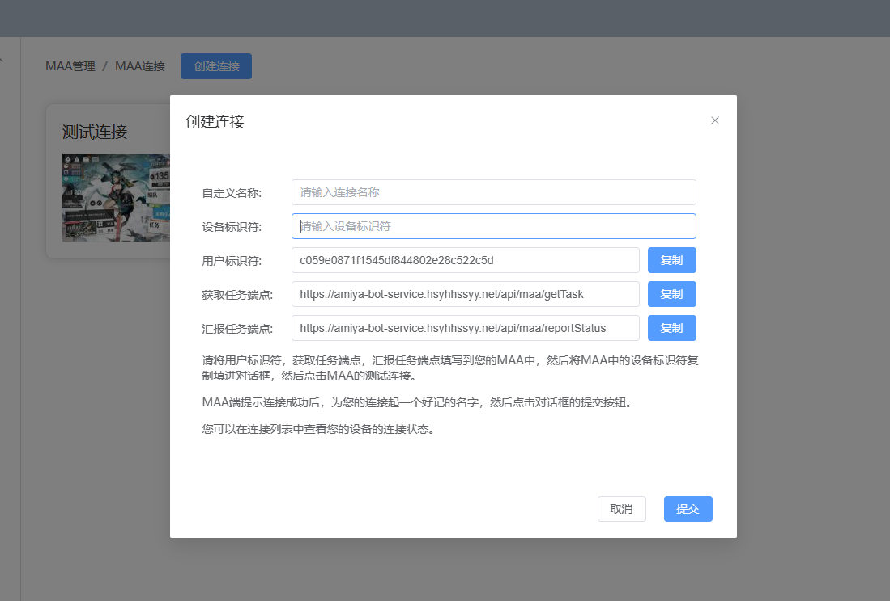
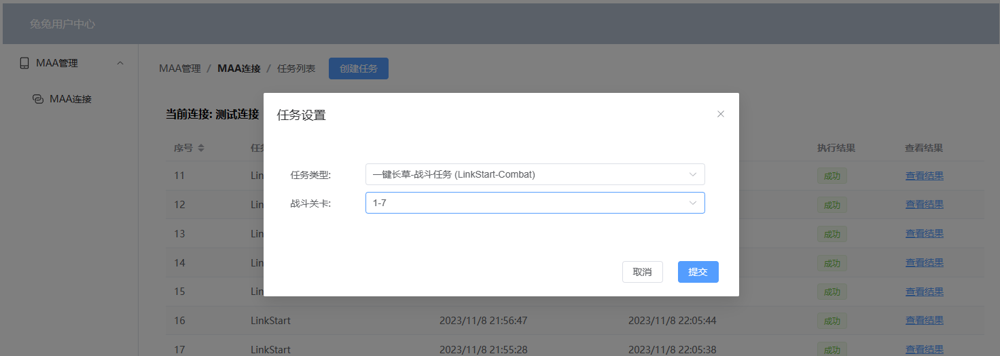
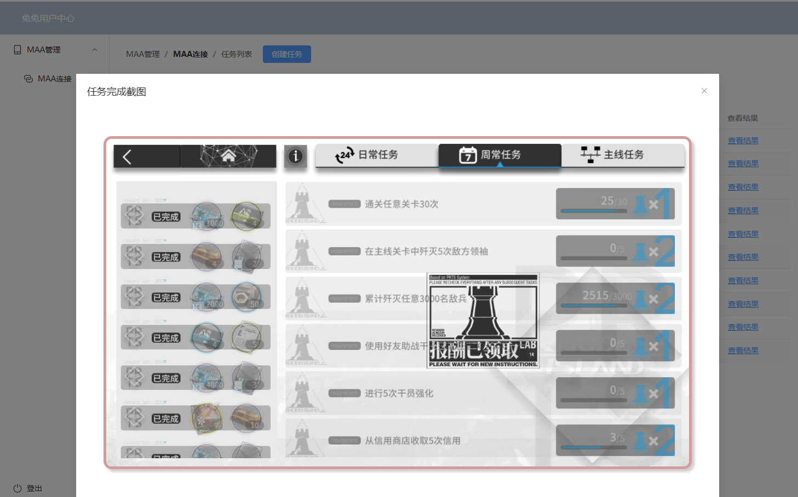

# 兔兔用户中心（前端）

## 这是什么？

一个可以利用MAA的远程控制功能，通过Web管理MAA的网页。

一个已经部署好的实例，访问这里：[管理后台](https://amiya-bot-service.hsyhhssyy.net/)。

话不多说，看图：

## 备注

[这是后端的Repo](https://github.com/hsyhhssyy/AmiyaBotPlayerRatingServer/) 但是里面还是以前的隐藏功能的介绍。